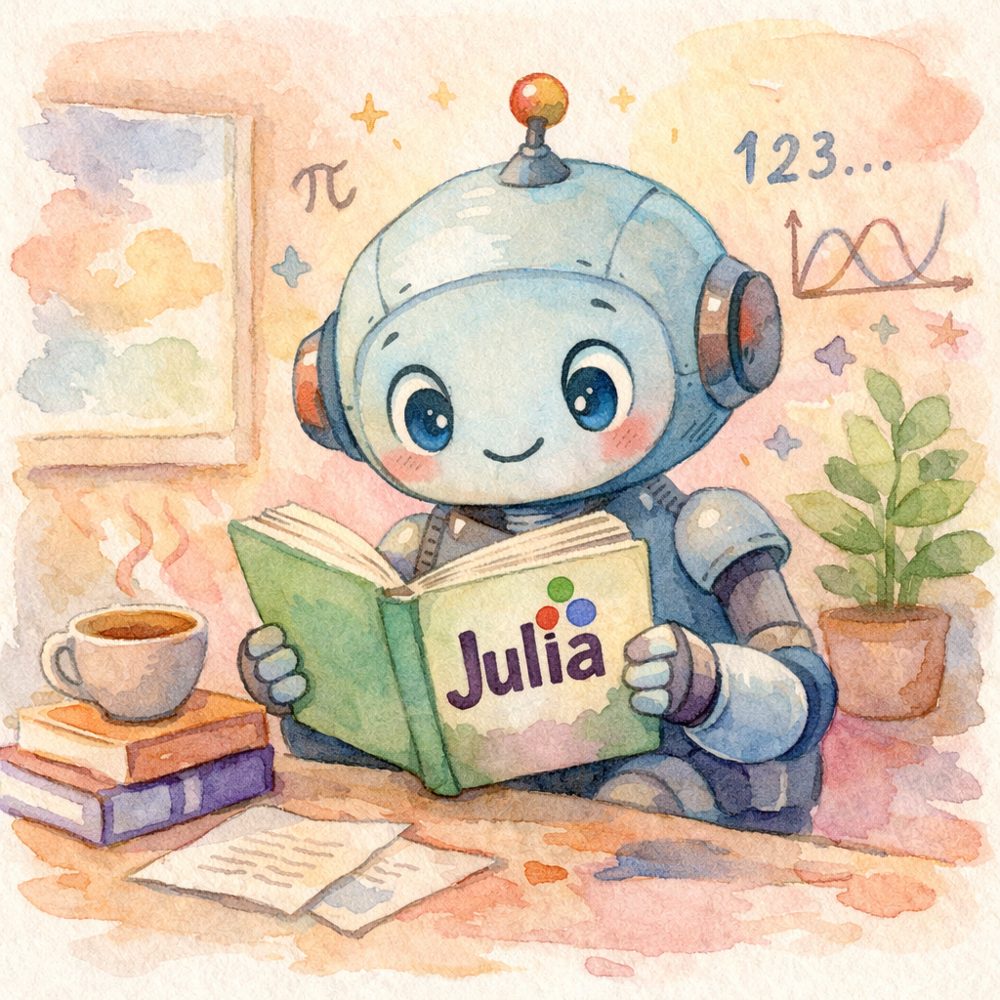

# UniLM.jl

*A unified Julia interface for large language models.*

[](https://github.com/algunion/UniLM.jl/actions/workflows/CI.yml)
[](https://codecov.io/gh/algunion/UniLM.jl)
[](https://github.com/JuliaTesting/Aqua.jl)
[](https://github.com/aviatesk/JET.jl)
[](https://algunion.github.io/UniLM.jl/stable/)
[](https://algunion.github.io/UniLM.jl/dev/)

## What is UniLM.jl?

UniLM.jl provides a **Julian**, type-safe interface to **LLM providers** via the OpenAI-compatible API standard — covering the **Chat Completions API**, the **Responses API**, **Image Generation**, **Embeddings**, and **MCP**. Works with OpenAI, Azure, Gemini, Mistral, DeepSeek, Ollama, vLLM, LM Studio, and any OpenAI-compatible provider.

### Key Features

- 🗣️ **Chat Completions** — stateful conversations with automatic history management
- 🔮 **Responses API** — OpenAI's newer API with built-in tools, multi-turn chaining, and reasoning
- 🖼️ **Image Generation** — create images from text prompts with `gpt-image-1.5`
- 🔧 **Tool/Function Calling** — first-class support for function tools in both APIs, with automated `tool_loop`
- 🔌 **MCP (Model Context Protocol)** — connect to MCP servers or build your own, with seamless tool loop integration
- 📊 **Embeddings** — text embedding generation
- 🌊 **Streaming** — real-time token streaming with `do`-block syntax
- 📐 **Structured Output** — JSON Schema–constrained generation
- ☁️ **Multi-Backend** — OpenAI, Azure, Gemini, DeepSeek, Ollama, Mistral, vLLM, LM Studio
- ✅ **Type Safety** — invalid states are unrepresentable; tested with [JET.jl](https://github.com/aviatesk/JET.jl) and [Aqua.jl](https://github.com/JuliaTesting/Aqua.jl)

### Two APIs, One Package

| Feature                |       Chat Completions       |            Responses API            |
| :--------------------- | :--------------------------: | :---------------------------------: |
| Stateful conversations |       `Chat` + `push!`       |       `previous_response_id`        |
| System prompt          | `Message(Val(:system), ...)` |        `instructions` kwarg         |
| Tool calling           |  `GPTTool` / `GPTToolCall`   |  `FunctionTool` / `function_tool`   |
| Web search             |              —               |           `WebSearchTool`           |
| File search            |              —               |          `FileSearchTool`           |
| Streaming              |   `stream=true` + callback   |          `do`-block syntax          |
| Structured output      |       `ResponseFormat`       | `TextConfig` / `json_schema_format` |
| Reasoning (O-series)   |              —               |             `Reasoning`             |
| Automated tool loop    |       `tool_loop!`           |          `tool_loop`                |
| MCP integration        |    `mcp_tools` bridge        |   `MCPTool` / `mcp_tool`            |

## Installation

```julia
using Pkg
Pkg.add(url="https://github.com/algunion/UniLM.jl")
```

Or in the Pkg REPL:

```
pkg> add https://github.com/algunion/UniLM.jl
```

## Quick Example

Building requests — these construct objects locally without calling the API:

```@example quickstart
using UniLM
using JSON

# Chat Completions request
chat = Chat(model="gpt-5.2")
push!(chat, Message(Val(:system), "You are a Julia expert."))
push!(chat, Message(Val(:user), "Explain multiple dispatch in one sentence."))
println("Chat has ", length(chat), " messages, model: ", chat.model)
println("Request body preview:")
println(JSON.json(chat))
```

```@example quickstart
# Responses API request
r = Respond(input="What makes Julia special?")
println("Respond model: ", r.model)
println(JSON.json(r))
```

```@example quickstart
# Image Generation request
ig = ImageGeneration(prompt="A watercolor Julia logo", quality="high")
println("Image model: ", ig.model)
println(JSON.json(ig))
```

With a valid API key, actual API calls return structured results:

**Responses API** (recommended for new code):
```@example quickstart
result = respond("Explain Julia's multiple dispatch in 2-3 sentences.")
if result isa ResponseSuccess
    println(output_text(result))
else
    println("Request failed — ", output_text(result))
end
```

**Chat Completions:**
```@example quickstart
chat = Chat(model="gpt-4o-mini")
push!(chat, Message(Val(:system), "You are a concise Julia programming tutor."))
push!(chat, Message(Val(:user), "What is multiple dispatch? Answer in 2-3 sentences."))
result = chatrequest!(chat)
if result isa LLMSuccess
    println(result.message.content)
else
    println("Request failed — see result for details")
end
```

**Image Generation:**
```@example quickstart
result = generate_image(
    "A watercolor painting of a friendly robot reading a Julia programming book",
    size="1024x1024", quality="medium"
)
println("Success: ", result isa ImageSuccess)
if result isa ImageSuccess
    save_image(image_data(result)[1], joinpath(@__DIR__, "assets", "generated_robot.png"))
    println("Saved to assets/generated_robot.png")
else
    println("Image generation failed — see result for details")
end
```



## Next Steps

- [Getting Started](@ref) — setup and first requests
- [Chat Completions Guide](@ref chat_guide) — deep dive into `Chat` and `chatrequest!`
- [Responses API Guide](@ref responses_guide) — the newer Responses API
- [Image Generation Guide](@ref images_guide) — create images from text prompts
- [MCP Guide](@ref mcp_guide) — connect to MCP servers or build your own
- [API Reference](@ref chat_api) — full type and function reference
